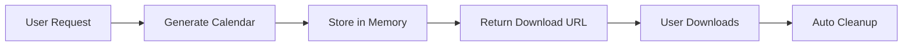

# 🚀 Deployment Guide for "your iCal"

This guide explains how to deploy the calendar generation application to Vercel and other platforms.

## 🏗️ Architecture Overview

### Serverless-First Design
- **Combined Frontend/Backend**: Single repository with Vue.js frontend and Express.js API
- **Memory-Based Storage**: Calendar files streamed directly without disk storage
- **Session-Based Downloads**: Temporary in-memory storage with automatic cleanup
- **Stateless Functions**: Each request is independent and scalable

### File Storage Solution


## 🌐 Vercel Deployment (Recommended)

### Step 1: Repository Setup
```bash
# Ensure your code is in a Git repository
git init
git add .
git commit -m "Initial commit"
git branch -M main
git remote add origin <your-github-repo-url>
git push -u origin main
```

### Step 2: Vercel Configuration
The app includes pre-configured files:
- `vercel.json` - Deployment configuration
- `.vercelignore` - Files to exclude from deployment

### Step 3: Deploy via Vercel Dashboard
1. Visit [vercel.com](https://vercel.com) and sign in with GitHub
2. Click "New Project" → "Import Git Repository"
3. Select your repository
4. Vercel auto-detects the configuration
5. **Optional**: Set environment variables:
   - `PREDICTHQ_TOKEN` - Your PredictHQ API token (app works without it)
6. Click "Deploy"

### Step 4: Deploy via CLI (Alternative)
```bash
# Install Vercel CLI
npm install -g vercel

# Login to Vercel
vercel login

# Deploy to production
vercel --prod
```

## 🔧 Environment Variables

| Variable | Required | Description | Default |
|----------|----------|-------------|---------|
| `PREDICTHQ_TOKEN` | No | PredictHQ API authentication | Fallback events |
| `NODE_ENV` | No | Environment mode | `production` |

## 📁 File Structure for Deployment

```
your-ical/
├── vercel.json              # Vercel configuration
├── .vercelignore           # Deployment exclusions
├── server.js               # Express.js serverless function
├── utils.js                # Calendar utilities
├── package.json            # Backend dependencies
├── frontend/               # Vue.js application
│   ├── dist/              # Built frontend (auto-generated)
│   ├── src/               # Source code
│   └── package.json       # Frontend dependencies
└── public/                # Static assets (built from frontend)
```

## 🚀 Alternative Deployment Platforms

### Netlify Functions
```bash
# Install Netlify CLI
npm install -g netlify-cli

# Deploy
netlify deploy --prod
```

### Railway
```bash
# Install Railway CLI
npm install -g @railway/cli

# Deploy
railway deploy
```

### Heroku
```bash
# Create Procfile
echo "web: node server.js" > Procfile

# Deploy
git add .
git commit -m "Add Procfile"
heroku create your-ical-app
git push heroku main
```

## 🔍 Testing Deployment

### Local Testing
```bash
# Test production build locally
pnpm run build
NODE_ENV=production node server.js
```

### Vercel Testing
```bash
# Test with Vercel CLI locally
vercel dev
```

## 🛠️ Troubleshooting

### Common Issues

#### 1. Build Failures
```bash
# Clear cache and rebuild
rm -rf frontend/node_modules frontend/dist
cd frontend && pnpm install && pnpm run build
```

#### 2. API Routes Not Working
Check `vercel.json` routes configuration:
```json
{
  "routes": [
    { "src": "/api/(.*)", "dest": "/server.js" },
    { "src": "/(.*)", "dest": "/server.js" }
  ]
}
```

#### 3. Download Links Broken
Ensure the new download endpoint is working:
- Calendar generation: `POST /api/generate-calendar`
- File download: `GET /api/download/{sessionId}`

#### 4. Memory Issues
The app automatically cleans up old calendar data:
- Sessions expire after 10 minutes
- Downloaded files are deleted after 1 second
- Maximum memory usage is limited

### Debug Commands
```bash
# Check build output
pnpm run build

# Test API endpoints
curl -X POST http://localhost:3000/api/generate-calendar \
  -H "Content-Type: application/json" \
  -d '{"location":"50km@40.7128,-74.0060","categories":"public-holidays","weeks":1,"cityName":"New York"}'

# Test download
curl -O http://localhost:3000/api/download/{sessionId}
```

## 📊 Performance Considerations

### Vercel Limits
- **Function Duration**: 30 seconds (configured in vercel.json)
- **Memory**: 1024MB for hobby plan
- **File Size**: No limit (streaming approach)
- **Requests**: 100GB bandwidth on hobby plan

### Optimization Tips
1. **Memory Management**: Calendar data auto-cleanup
2. **Fast Downloads**: Direct streaming without file I/O
3. **Cache Headers**: Proper cache control for static assets
4. **Error Handling**: Graceful fallbacks for API failures

## 🔒 Security Best Practices

### API Security
- No persistent file storage (reduces attack surface)
- Temporary session-based downloads
- Input validation on all endpoints
- Rate limiting via Vercel's built-in protection

### Environment Variables
```bash
# Never commit sensitive data
echo ".env" >> .gitignore
echo ".env.local" >> .gitignore
```

## 📈 Monitoring

### Vercel Analytics
- Built-in performance monitoring
- Error tracking in dashboard
- Function logs for debugging

### Custom Monitoring
```javascript
// Add to server.js for custom metrics
console.log(`Calendar generated: ${eventCount} events for ${cityName}`);
```

## 🎯 Production Checklist

- [ ] Frontend built successfully (`pnpm run build`)
- [ ] All API endpoints tested
- [ ] Environment variables configured
- [ ] Domain configured (if using custom domain)
- [ ] Error handling tested
- [ ] Download functionality verified
- [ ] Memory cleanup working
- [ ] API documentation accessible

---

**🎉 Your calendar application is now ready for production deployment!**

For support, check the main [README.md](./README.md) or create an issue in the repository.